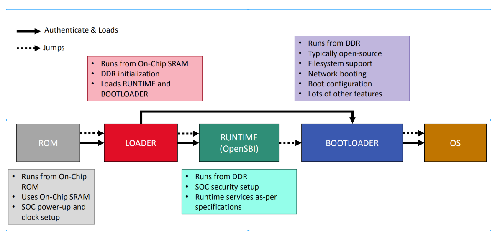

基于OpenSBI v1.3对基本boot流程做简要解析




### fw_base.S
OpenSBI从这里进入，这里提供了`_start`符号：
```asm
    	.section .entry, "ax", %progbits
	.align 3
	.globl _start
	.globl _start_warm
_start:
	/* Find preferred boot HART id */
	MOV_3R	s0, a0, s1, a1, s2, a2
	call	fw_boot_hart
	add	a6, a0, zero
	MOV_3R	a0, s0, a1, s1, a2, s2
	li	a7, -1
	beq	a6, a7, _try_lottery
	/* Jump to relocation wait loop if we are not boot hart */
	bne	a0, a6, _wait_relocate_copy_done
_try_lottery:
	/* Jump to relocation wait loop if we don't get relocation lottery */
	lla	a6, _relocate_lottery
	li	a7, 1
	amoadd.w a6, a7, (a6)
	bnez	a6, _wait_relocate_copy_done

	/* Save load address */
	lla	t0, _load_start
	lla	t1, _fw_start
	REG_S	t1, 0(t0)
```
